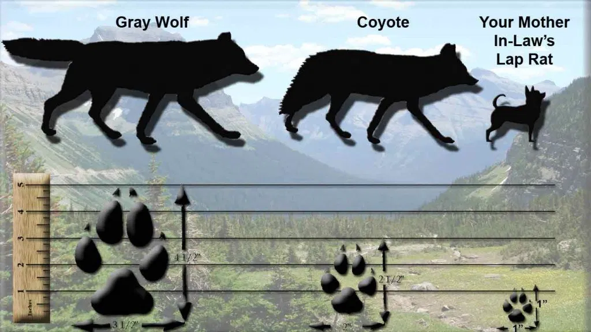

<!-- PROJECT LOGO -->
 

  

  <h3 align="center">Coyote-Wolf-Dog-Classifier</h3>

<!-- TABLE OF CONTENTS -->
## Table of Contents

* [Description](#about-the-project)
* [Data Exploration](#data-exploration)
* [Pipeline](#pipeline)
* [Transfer Learning](#transfer-learning)
* [Results](#results)
* [Next Steps](#next-steps)

<!-- ABOUT THE PROJECT -->
## Description

I wanted an opportunity to explore Transfer Learning and Image Classification. In my search for an available dataset and a project purpose, I remembered a recent article about a resurgence of coyote activity in San Francisco thanks to the recent decrease in human activity. I have always had trouble distinguishing between coyotes and other canines, so I decided to build an image classifier to classify pictures of coyotes, wolves, and domesticated dogs (not that there will be wolves coming into SF any time soon, but I wanted to gain experience in multi-class models).

[Coyote Article](https://www.sfgate.com/living-in-sf/article/New-footage-Coyotes-take-to-SF-rooftops-frolick-15257171.php#item-95844-tbla-2)

## Data Overview
My data was taken from Imagenet, an open source image library. It is structured such that by doing an API call with a certain ID, you can access a list of url links to photos of that ID item.

From Imagenet, I loaded in every available photo from the following species IDs:  n02114855|Coyote, n02084071|Dog, n02114367|Wolf

There were many links available for each category on Imagenet's site
* Coyote: 1664
* Dog: 1603
* Wolf: 1820

---

## Data Exploration

#### Cleaned Data
To be expected, some of the links were no longer active, and some of the photos were smaller than my resize shape (see below), and so not each link produced a usable image.

After resizing photos to (224,224,3), I was able to download the following number of useable photos
* Coyote: 911
* Dog: 771
* Wolf: 862

Here is an example of each after resizing:

[Back To The Top](#read-me-template)

---

## Pipeline
### TensorFlow Directory Structure

I utilized tensorflow's flow_from_directory method to load in my photos. Because of this, I had to be sure to load my photos in with the following format with the photos saved as jpg files:

  |-Images 

         |-Coyote

         |-Dog
         
         |-Wolf

### Data Augmentation

To increase the effectivenss of the relatively small train set, I used TF's ImageDataGenerator it set to adjust the shear, rotation, zoom, and a horizontal flip of the photos randomly as they are called on when training the model. 

This method serves to avoid overfitting by artificially gernerating "new" images so that the model can capture angles/positions/sizes of the objects that do not actually exist in the training set. 

## Transfer Learning

### Base

Because of the limited timeline to perform this project, I decided to use the MobileNetV2 model with the Imagenet weights loaded as the base model. I removed the top from this model, to append my own classifier on top. 

Froze the convolutional base as the model is trained on similar images so should not require any fine-tuning.

### Classifying Layers

Structure:
1. Global Average Pooling
2. 3 Fully Connected Dense Layers
3. One half reduction Dense Layer
4. Classifying Dense layer

Average pooling helps to prevent overfitting by averaging the vectorized images. In concept, this keeps the model from focusing on the location of features in the images

---

## Results
### Metrics

I will in this section include the loss and acc graphs of the model over the epochs, as well as a confusion matrix on the validation data - I have the scripts written I am just waiting for my final model to finish

## Next Steps
-Harvest data from instagram to test model on

-Test out other classification architectures

-Test out other pre-trained models

-Save augmented images into drive to perform preliminary feature extraction : will significantly reduce training time in future

[Back To The Top]
